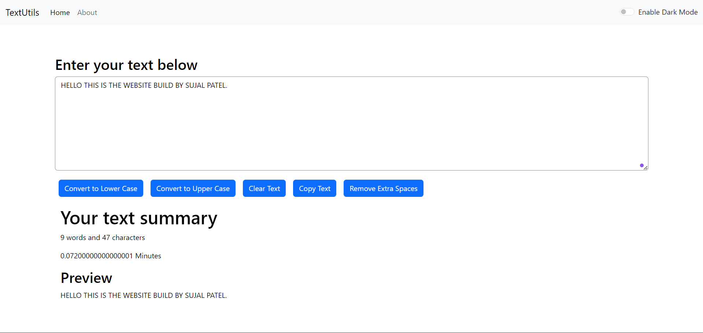

<h1>TextUtils</h1>

TextUtils is a versatile text manipulation tool built with React. It offers features like converting text to uppercase or lowercase, clearing text, removing extra spaces, copying text, counting words and characters, and providing a real-time preview of the modified text.

Features
<ul style="font-size: 16px;">
  <li><strong>Case Conversion</strong>: Switch between uppercase and lowercase effortlessly.</li>
  <li><strong>Clear Text</strong>: Clear the text area with a single click.</li>
  <li><strong>Remove Extra Spaces</strong>: Trim extra spaces from your text.</li>
  <li><strong>Copy Text</strong>: Copy the entire text to your clipboard with ease.</li>
  <li><strong>Word and Character Count</strong>: Get instant counts of words and characters.</li>
  <li><strong>Live Preview</strong>: See real-time updates of your text as you type or modify it.</li>
  <li><strong>Light and Dark Mode</strong>: Get light and dark mode with the toggle button on top.</li>
</ul>
Demo

Getting Started

These instructions will help you set up and run the project on your local machine.

Prerequisites

  <ul>
    <li>npm (Node Package Manager) or yarn</li>
  </ul>

Installation

  <ol>
    <li><strong>Clone the repository:</strong></li>
  </ol>

        <pre id="code-example">
git clone https://github.com/sujalPatel6021/textutils.git
cd textutils
        </pre>

  <ol start="2">
    <li><strong>Install dependencies:</strong></li>
  </ol>

        <pre id="code-example">
npm install
&nbsp;&nbsp;&nbsp;# or
yarn install
        </pre>

  <ol start="3">
    <li><strong>Start the development server:</strong></li>
  </ol>

        <pre id="code-example">
npm start
&nbsp;&nbsp;&nbsp;# or
yarn start
        </pre>

Open your browser and navigate to <code>http://localhost:3000</code> to see the TextUtils app in action.

 
 
<h2>Usage</h2>

1. **Enter Text**: Type or paste your text into the text area.

2. **Choose an Action**: Use the available buttons to:

<ul style="font-size: 16px;">
  <li>Convert text to uppercase or lowercase.</li>
  <li>Clear the entire text.</li>
  <li>Remove extra spaces from the text.</li>
  <li>Copy the text to the clipboard.</li>
</ul>

3. **View the Result**: The updated text will be shown in the text area and preview section.

4. **Check Statistics**: Word and character counts are displayed below the text area.

 
 
<h2>Contributing</h2>

Contributions are welcome! To contribute:

<ul style="font-size: 16px;">
  <li>Fork the repository.</li>
  <li>Create a new branch</li>
  <li>Commit your changes</li>
  <li>Push to the branch</li>
  <li>Create a pull request.</li>
</ul>

Please ensure your code adheres to our coding standards and is well-documented.

 
 
<h2>License</h2>

This project is licensed under the MIT License.

 
 
<h2>Acknowledgments</h2>

This project was inspired by various text manipulation tools and community suggestions. Thanks to all contributors and users for their support and feedback.

 
 
<h2>Contact</h2>

For any questions or suggestions, please open an issue or contact [sujalpatel6021@gmail.com].

